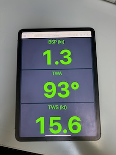
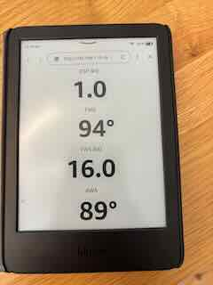

# Live NMEA  Dashboard

A minimal FastAPI + WebSocket + UDP listener app that parses NMEA sentences, applies a small-time-constant exponential moving average to each data field, and pushes live updates to a single-column, multi-row browser dashboard.


##  Features


- **Instant Live Readings**: Realtime NMEA0183 data 
- **Customizable Dashboard**: Choose exactly which data points to display via simple command-line flags—no code changes needed.  
- **Clutter-Free View**: Large, easy-to-read numbers optimized for ipad/android/kindle/ereaders, only upates on change
- **Auto-Reconnect**: Page re-connects on interruption
- **Adjustable Smoothing**: Allows configuration of exonential moving average for smooth display
- **Lightweight & Self-Hosted**: A simply python script to post and a web-brower to display




Supports
- BSP, TWA, TWS TWD, SOG, COG, AWA, AWS


## Requirements / Dependencies

- Python 3.8+  
- `fastapi`, `uvicorn[standard]`, `pynmea2`

```bash
pip install fastapi uvicorn[standard] pynmea2
```


##  Usage

   ```bash
   python nmea2web.py --udp-port 2002 --web-port 8000 --log-level ERROR --ema-smoothing-window 2 --display-data BSP TWA TWS
   ```

   There is also an option to specifiy colours for example e-readers will do much better with

   ```bash
   python nmea2web.py --udp-port 2002 --web-port 8000 --log-level ERROR --ema-smoothing-window 2 --display-data BSP TWA TWS --page-color "#FFFFFF" --cell-color "#FFFFFF" --text-color "#000000"
   ```


### Command-Line Arguments

| Flag                         | Default                     | Description                                                          |
|------------------------------|-----------------------------|----------------------------------------------------------------------|
| `--udp-port <port>`          | `2002`                      | UDP port to listen for NMEA sentences                                |
| `--web-port <port>`          | `8000`                      | HTTP/WebSocket server port                                           |
| `--log-level <LEVEL>`        | `ERROR`                     | Logging verbosity (`DEBUG`, `INFO`, `WARNING`, `ERROR`, `CRITICAL`)  |
| `--ema-smoothing-window <s>` | `2.0`                       | EMA time constant in seconds                                         |
| `--display-data <KEY> [...]` | `BSP TWA HDG`               | Which metrics (CELLS keys) to render                                 |
| `--page-color <hex>`         | `#171F2F`                   | Page background color (hex, e.g. `#171F2F` or `#ffffff`)             |
| `--cell-color <hex>`         | `#2A2D3C`                   | Cell background color (hex, e.g. `#2A2D3C` or `#ffffff`)             |
| `--text-color <hex>`         | `#75FB4C`                   | Text color (hex, e.g. `#75FB4C` or `#ffffff`)                        |


### Normal Browser
Open your browser to `http://<host>:<web-port>/`.


### Chrome Kiosk Mode - Mac 
```
  open -a "Google Chrome" --args --kiosk http://<host>:<web-port>/ --incognito --no-first-run --noerrdialogs --disable-infobars
```

### iPad/Android/Kindle - Anything with a webbrower
- Guided Access Mode (Built into iPad OS)
- Kiosker (iPad)
- Kindle (webbrower)


## How it Works

1. **UDP Listener**  
   - Binds UDP on the specified `--udp-port`  
   - Parses datagrams with `pynmea2.parse`  
   - Enqueues messages in an `asyncio.Queue`

2. **Processor**  
   - Loops `await message_queue.get()`  
   - `if isinstance(msg, …)` to extract fields  
   - Calls `update_ema_and_state(key, value)`  
   - `broadcast(key)` sends `"KEY:VALUE"` via WebSocket

3. **WebSocket Endpoint**  
   - On connect, streams last-known EMAs for all `SHOW_KEYS`  
   - Streams live updates as `"KEY:formatted_value"`

4. **Browser Client**  
   - Builds a CSS grid for each key in `SHOW_KEYS`  
   - Auto-reconnects, logs events, and updates DOM on each message  
   - Dynamically sizes fonts to ~15%/65% of cell height for label/value

